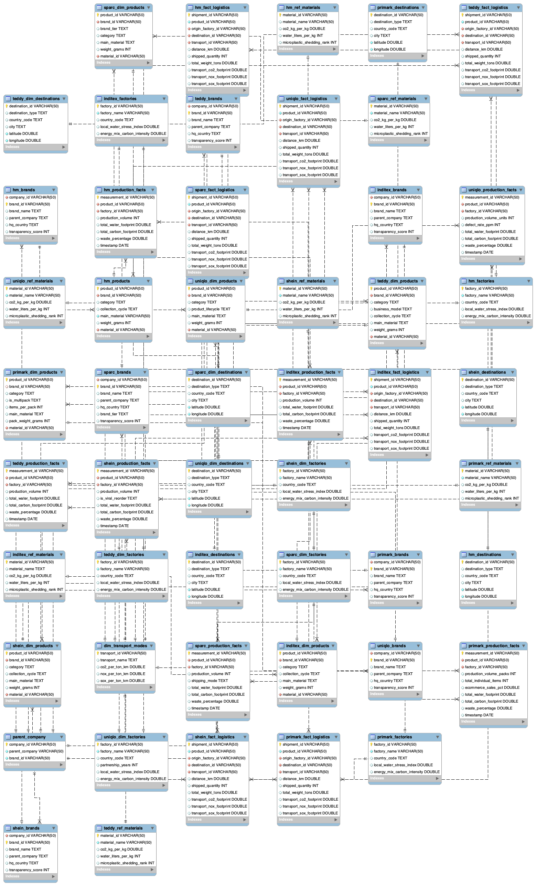

# fast-fashion-data-engineering
End-to-end Data Engineering project analyzing the environmental impact (CO2, Water, Microplastics) of 7 Fast Fashion brands using SQL, PowerQuery, and Python.
Overview:
This project conducts a comprehensive analysis of the environmental footprint of 7 global fast-fashion leaders: H&M, Inditex, Uniqlo, Primark, Shein, Sparc, and Teddy. The primary objective is to quantify environmental impact by calculating key metrics such as Carbon Footprint (CO2), Water Footprint, Waste Percentage, and Microplastic Shedding across the entire supply chain.
Tech Stack & Architecture:
Data Cleaning & Ingestion: Microsoft Excel & PowerQuery for pre-processing heterogeneous datasets;
Database Management: MySQL for relational modeling and structured storage;
Data Transformation (ETL): Advanced SQL (Stored Procedures, CTEs, Window Functions, and Views);
Data Visualization: Python (Seaborn & Matplotlib) for exploratory data analysis and performance heatmaps.
Data Modeling (ER Schema):
The database was designed following a Star Schema logic to optimize analytical queries. The architecture allows for seamless cross-referencing between production volumes, logistics facts, and material reference tables.

Business Logic & Algorithms:
The project implements modular SQL solutions to handle complex data engineering challenges:
Unified Data Model
As data originated from 7 different brands, I utilized UNION ALL within structured Views to create a Single Source of Truth. This enables comparative cross-brand analysis without querying separate tables for each company;
ESG Sustainability Rating Algorithm:
I developed a synthetic indicator to classify brands based on their ecological efficiency. The scoring formula is:  
Score=(CO2 
unit
 ×10)+( 
10
Water 
unit
 )+Waste%+(Microplastics 
rank
 ×10)
This score is translated into an alphabetical grade (A to F) using SQL conditional logic (CASE WHEN), providing an immediate understanding of environmental performance.
Key Insights & Analytics:
The analysis highlights significant discrepancies between production scale and material efficiency.
Global Performance: The heatmap reveals how some brands offset high production with a cleaner energy mix, while others show persistent criticalities across all metrics;
Transparency Analysis: The Transparency Score reveals the reliability and verifiability of the environmental data declared by each brand.
[(04_Analytics_&_Viz/01_Global_Overview_&_Performance/Performance_Ambientale_HeatMap.png)](https://github.com/ElenaPiracci/fast-fashion-data-engineering/tree/main/04_Analytics_%26_Viz%3A/01_Global_Overview_%26_Performance)
Visual Insights & Reports:
The final analysis is presented through interactive dashboards and a comprehensive technical report.
**[Download the Full Technical Report (PDF)](05_Project_Report/Elena_Piracci_FastFashion_Project.pdf)**
Key Insight: Logistics (specifically Air Cargo) and material choice are the primary drivers of carbon intensity in the analyzed supply chains.

How to Reproduce
Clone the repository:
git clone [https://github.com/ElenaPiracci/fast-fashion-data-engineering.git](https://github.com/ElenaPiracci/fast-fashion-data-engineering.git)
Setup Database: Execute the SQL scripts in the 03_SQL_Logic folder following the numerical order (01 to 04). This ensures functions and procedures are created before the analytical views.
Analyze: Explore the visual results in the 04_Analytics_&_Viz/plots/ directory.
Key Findings (Insights)
Based on the generated analytics and visualizations, some key trends emerged:  
Transparency Gap: There is a significant disparity in transparency scores between brands, with leaders like H&M scoring significantly higher than ultra-fast-fashion players like Shein.  
Efficiency vs. Volume: Some brands manage to lower their individual carbon intensity through cleaner factory energy mixes, even when production volumes are high.
Material Impact: The data highlights that the choice of raw materials (e.g., recycled vs. virgin polyester) often has a greater impact on the final ESG grade than logistics-related emissions.
In a real-world production environment, this pipeline could be improved by:
Automated Ingestion: Connecting directly to brand sustainability APIs instead of manual CSV uploads.
Real-time Monitoring: Implementing a dashboard (e.g., Tableau or PowerBI) connected to the MySQL views.
ML Integration: Using predictive modeling to forecast future environmental impact based on seasonal production trends.
Author
Elena Piracci
www.linkedin.com/in/elenapiracci
